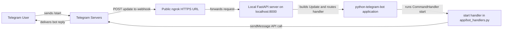

# Gringotts

Gringotts is a Telegram bot for tracking shared group travel expenses, calculating who owes whom, and exporting trip data to Excel.

The current codebase is in the early setup stage. Right now it provides:

- A Telegram bot application built with `python-telegram-bot`
- A FastAPI server to receive Telegram webhook updates locally
- An ngrok-based helper flow so Telegram can reach a local machine during development
- A minimal `/start` command to verify the bot wiring end to end

## Tech Stack

- Python
- `python-telegram-bot`
- FastAPI
- Uvicorn
- `python-dotenv`
- `openpyxl` for later Excel export work

## Project Structure

```text
gringotts/
├── app/
│   ├── bot_handlers.py
│   ├── config.py
│   ├── main.py
│   └── ngrok_utils.py
├── requirements.txt
└── README.md
```

## Current Status

### Phase Tracker

| Phase   | Goal                                         | Status      |
| :------ | :------------------------------------------- | :---------- |
| Phase 1 | Bot setup, env loading, basic command wiring | Complete    |
| Phase 2 | SQLite setup and schema creation             | Not started |
| Phase 3 | Ledger logic and balance calculation         | Not started |
| Phase 4 | Telegram conversation flows                  | Not started |
| Phase 5 | Excel export                                 | Not started |
| Phase 6 | Settlements, editing, polish                 | Not started |

### Why Phase 1 Counts As Complete

Phase 1 was defined as:

- Load secrets from `.env`
- Start the bot application successfully
- Respond to `/start`

The current project satisfies the code-level requirements and has already gone a step beyond the original polling-only version by using a local webhook flow with FastAPI and ngrok.

One operational note: if startup fails with `address already in use`, that is not a Phase 1 code problem. It only means port `8000` is already occupied by another process.

## How The Current App Works

1. `app/config.py` loads environment variables.
2. `app/main.py` builds the Telegram application.
3. FastAPI exposes a health route and a Telegram webhook route.
4. `app/ngrok_utils.py` fetches the public ngrok HTTPS URL.
5. On startup, the app registers the webhook with Telegram.
6. Telegram sends updates to the webhook endpoint.
7. `app/bot_handlers.py` contains the `/start` command handler.

## Webhook Flow Diagram

This diagram shows how Telegram reaches your local machine during development when you use ngrok.



You can think about it in two halves:

- Incoming path: Telegram sends the webhook request to ngrok, and ngrok forwards it to your local FastAPI app.
- Outgoing path: your bot code uses the Telegram Bot API to send a reply back through Telegram's servers to the user.

## Environment Variables

Create a `.env` file in the project root with:

```env
BOT_TOKEN=your_telegram_bot_token
WEBHOOK_SECRET=your_random_secret_string
PORT=8000
```

Notes:

- `BOT_TOKEN` is the token from BotFather.
- `WEBHOOK_SECRET` is used in the webhook URL path so random internet traffic does not hit a predictable Telegram route.
- `PORT` defaults to `8000` if omitted.

## Install And Run

### 1. Create a virtual environment

```bash
python -m venv .venv
source .venv/bin/activate
```

### 2. Install dependencies

```bash
pip install -r requirements.txt
```

### 3. Start ngrok in a separate terminal

```bash
ngrok http 8000
```

### 4. Start the app

```bash
uvicorn app.main:app --host 127.0.0.1 --port 8000
```

### 5. Test the bot

- Open a private chat with the bot in Telegram.
- Send `/start`.
- You should receive the greeting from `app/bot_handlers.py`.

## Learning Notes

### `telegram` vs `telegram.ext`

This project uses both parts of the `python-telegram-bot` library.

- `telegram` contains Telegram domain objects like `Update`.
- `telegram.ext` contains higher-level application helpers like `ApplicationBuilder` and `CommandHandler`.

### Why FastAPI Is Here

FastAPI is not replacing the Telegram bot library. It is only acting as the HTTP server that receives webhook requests from Telegram.

### Why ngrok Is Here

Telegram must reach a public HTTPS URL when using webhooks. Since local development does not normally expose your machine to the internet, ngrok creates a temporary public tunnel to your local FastAPI server.

## Next Phase

Phase 2 will add SQLite initialization and the first version of the database schema for trips, members, expenses, payers, shares, and settlements.

## Updating This README

This README should be updated at the end of each completed phase so it always reflects:

- what has been built,
- what still remains,
- and how the current version of the project works.
